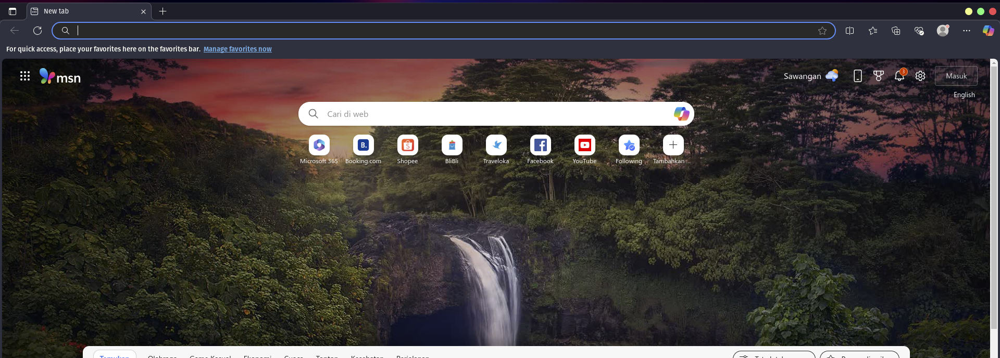
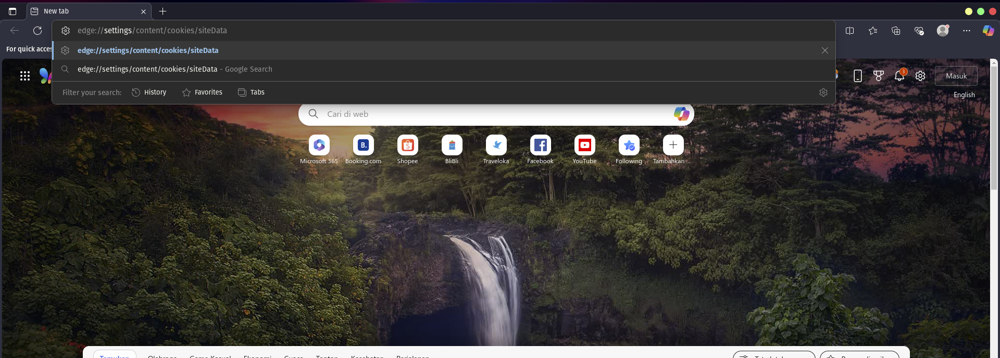
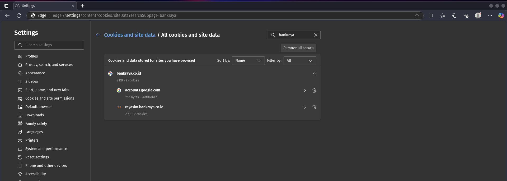
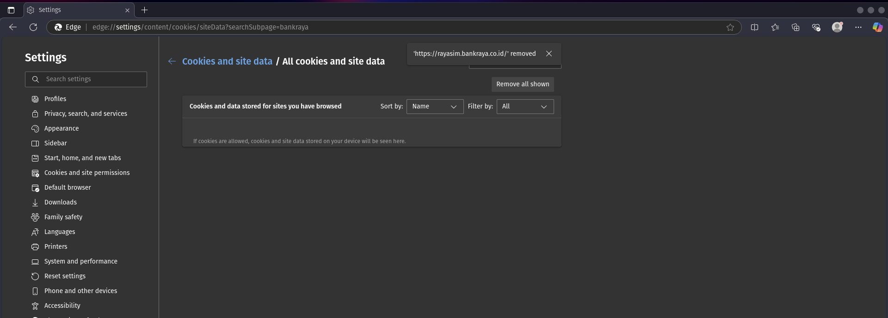

# Microsoft Edge

## 1. Buka Microsoft Edge

Pertama - tama kamu buka browser Microsoft Edge.

{border-effect=line}

## 2. Buka URL

Paste kan alamat di bawah ini ke browser pencarian kamu.

<code-block lang="plain text">edge://settings/content/cookies/siteData</code-block>

lalu tekan <shortcut>Enter</shortcut> pada keyboard kamu, kamu akan masuk ke halaman   
<b>Settings / Cookies and site data / All cookies and site data</b>

{border-effect=line}

## 3. Pencarian

Pada halaman Setting ini terdapat pencarian yang bersejajar dengan <b>Cookies and site data / All cookies and site data</b>

{border-effect=line}

Lalu ketikan <b>bankraya</b> pada pencarian tersebut, maka akan tampil 1 item <b>bankraya.co.id</b>

Pada 1 item itu, ada icon panah kebawah, kamu dapat mengklik icon tersebut.

## 4. Hapus item

{border-effect=line}

Ketika kamu mengklik icon panah kebawah, terdapat item - item data, kamu dapat mengklik icon tong sampah / hapus
satu persatu sampai kosong

## 5. Berhasil

Jika sudah di hapus semua,  maka akan terhapus seperti di gambar.

{border-effect=line}

Lalu kamu dapat membuka <b>RAYASIM</b> kembali, dan login menggunakan email bankraya kamu.

link RAYASIM : <a href="https://rayasim.bankraya.co.id"><b>RAYASIM</b></a>