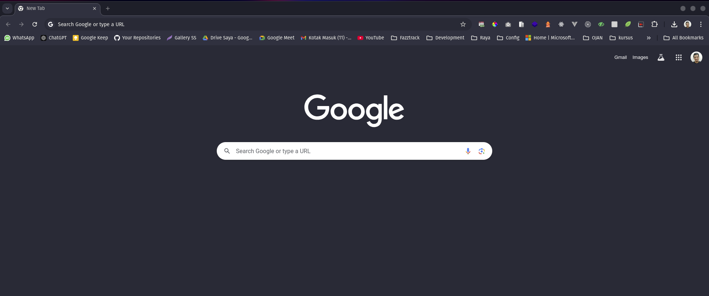
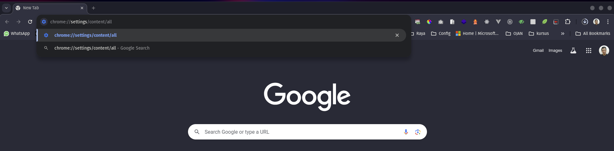
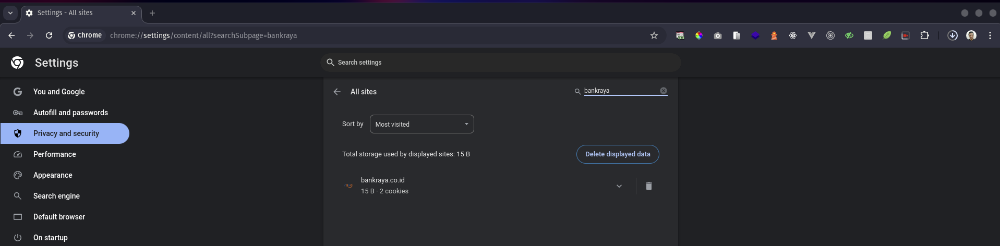
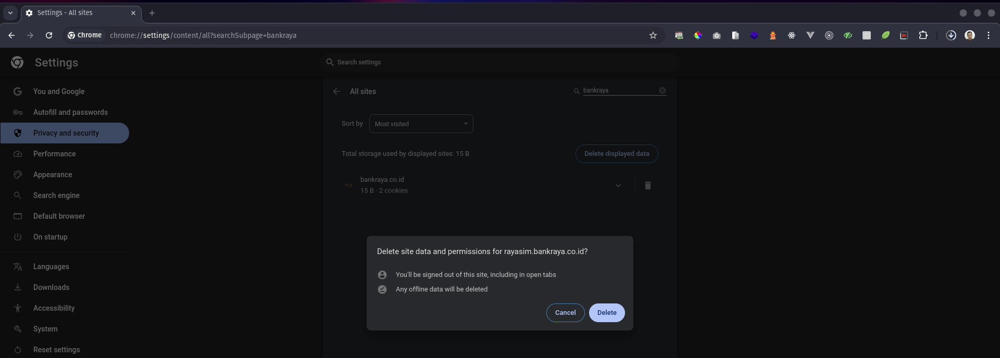
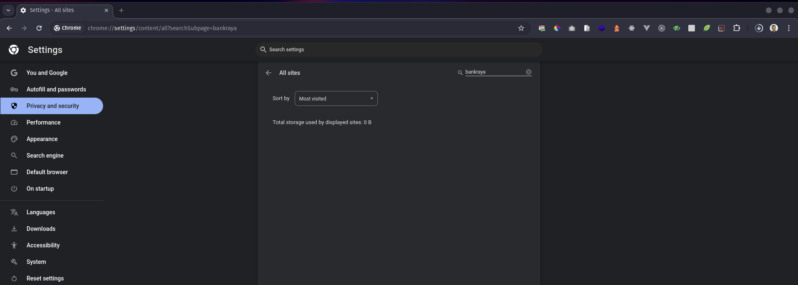

# Google Chrome

## 1. Buka Google Chrome

Pertama - tama kamu buka browser Google Chrome.

{border-effect=line}

## 2. Buka URL

Paste kan alamat di bawah ini ke browser pencarian kamu.

<code-block lang="plain text">chrome://settings/content/all</code-block>

{border-effect=line}

lalu tekan <shortcut>Enter</shortcut> pada keyboard kamu, kamu akan masuk ke halaman <b>Settings - All sites</b>

## 3. Pencarian

Pada halaman Settings - All sites, terdapat pencarian yang bersejajar dengan <b>All sites</b>

{border-effect=line}

Lalu ketikan <b>bankraya</b> pada pencarian tersebut, maka akan tampil 1 item <b>bankraya.co.id</b>

Pada 1 item itu, ada icon tong sampah / hapus, kamu dapat mengklik icon tersebut.

## 4. Hapus item

{border-effect=line}

Ketika kamu mengklik icon tong sampah / hapus, kamu pilih delete.

## 5. Berhasil

Jika sudah di delete maka akan terhapus seperti di gambar.

{border-effect=line}

Lalu kamu dapat membuka <b>RAYASIM</b> kembali, dan login menggunakan email bankraya kamu.

link RAYASIM : <a href="https://rayasim.bankraya.co.id"><b>RAYASIM</b></a>