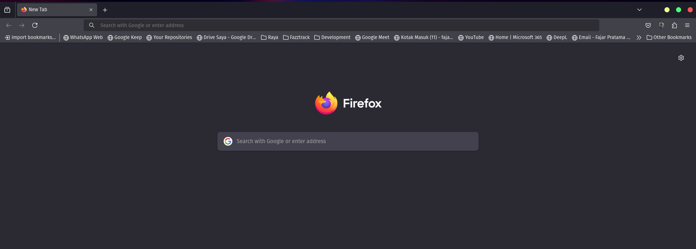
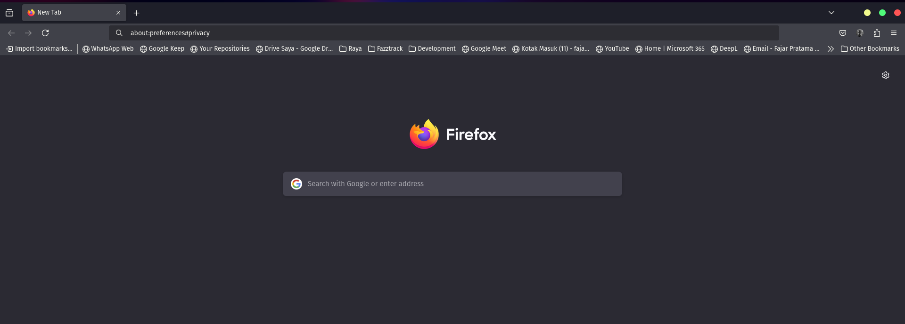
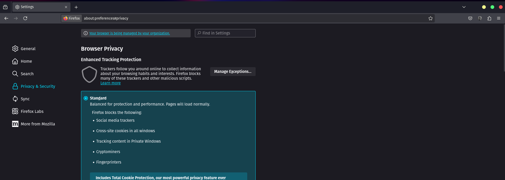
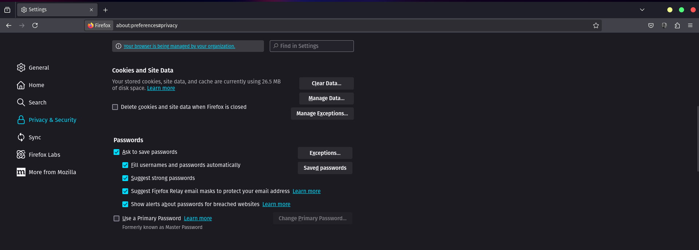
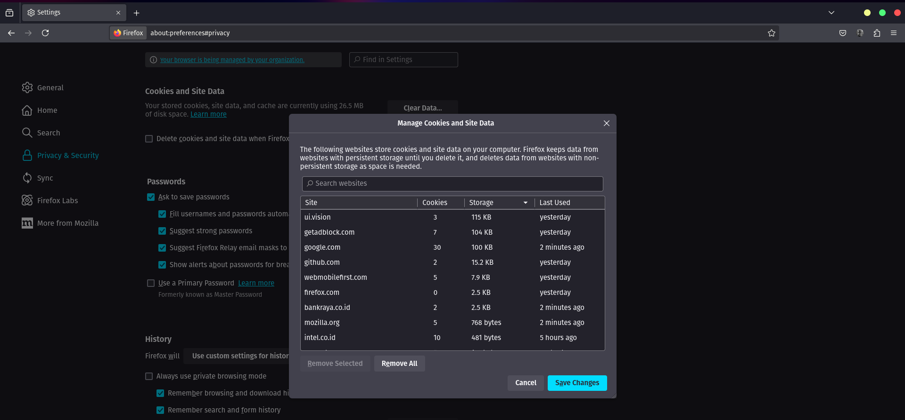
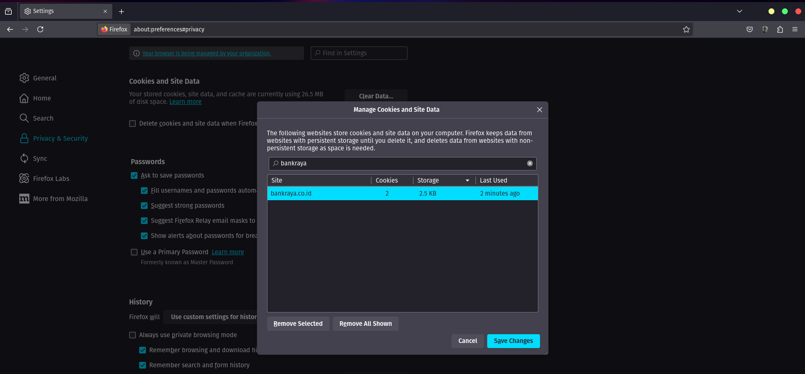
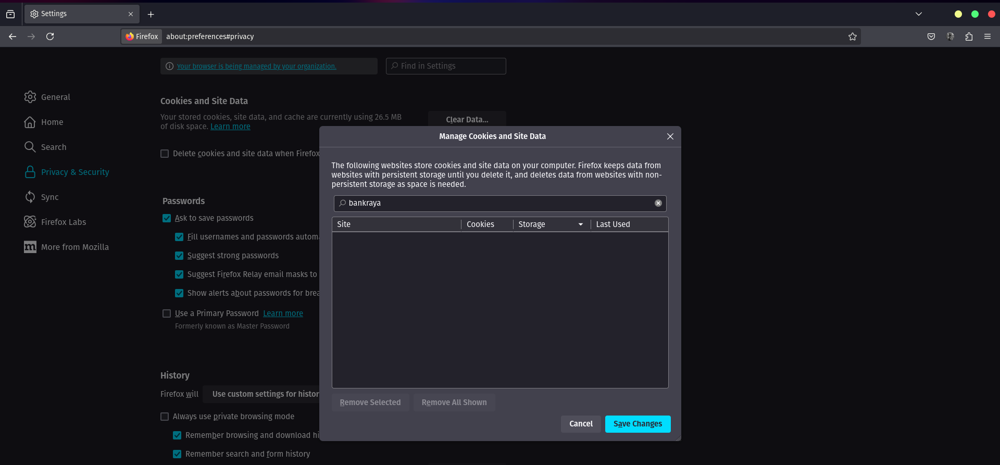
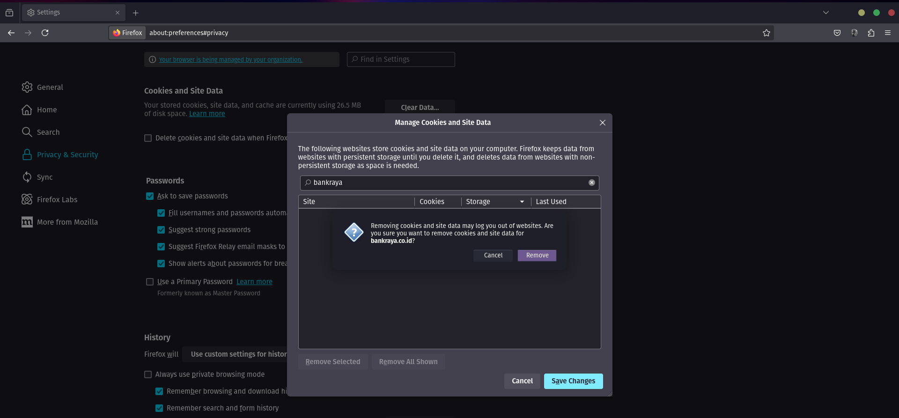

# Mozilla Firefox

## 1. Buka Mozilla Firefox

Pertama - tama kamu buka browser Mozilla Firefox.

{border-effect=line}

## 2. Buka URL

Paste kan alamat di bawah ini ke browser pencarian kamu.

<code-block lang="plain text">about:preferences#privacy</code-block>

{border-effect=line}

lalu tekan <shortcut>Enter</shortcut> pada keyboard kamu, kamu akan masuk ke halaman <b>Settings</b>

## 3. Pencarian

{border-effect=line}

Pada halaman Settings, kamu bisa scroll kebawah sampai ketemu <b>Cookies and Site Data</b>.
Kemudian kamu pilih <b>Manage Data</b> antara di bawah <b>Clear data..</b> dan <b>Manage Expections..</b>

{border-effect=line}

{border-effect=line}

Akan tampil Manage Cookies and Site Data, kemudian kamu lalu ketikan <b>bankraya</b> pada pencarian tersebut, 
maka akan tampil 1 item <b>bankraya.co.id</b>

{border-effect=line}

## 4. Hapus item

Pada item 1 yang kamu cari, lalu kamu klik bankraya.co.id / item tersebut.

{border-effect=line}

Kemudian kamu klik / pilih <b>Remove Selected</b>, sehingga akan terhapus item bankraya.co.id dalam pencarian.

{border-effect=line}

lalu tinggal kamu klik <b>Save Changes</b> dan akan muncul pop up, tinggal klik <b>Remove</b> yaah.

{border-effect=line}

## 5. Berhasil

Jika sudah di delete maka akan kembali ke halaman <b>Settings</b>

{border-effect=line}

Lalu kamu dapat membuka <b>RAYASIM</b> kembali, dan login menggunakan email bankraya kamu.

link RAYASIM : <a href="https://rayasim.bankraya.co.id"><b>RAYASIM</b></a>